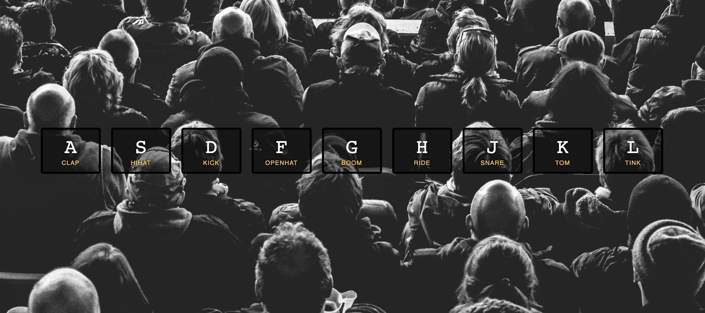

# 01 - JavaScript Drum Kit



## Main goals

- When a user presses a certain key, an audio will be played.
- CSS animation will change the key when it's pressed.

## Learning Notes
### Data Attributes in HTML
Link two elements using a custom data attribute
```html
<!-- Defining the 'data-key' attribute for the div -->
<div data-key="65" class="key">
    <kbd>A</kbd>
    <span class="sound">clap</span>
</div>
<!-- and it's corresponding audio element -->
<audio data-key="65" src="sounds/clap.wav"></audio>
```

### Grab the data attribute using the DOM query selector
In the callback function that takes in the event, you can use backticks to make it a dynamic query selector.

``` javascript
window.addEventListener('keydown', function(e) {
    const audio = document.querySelector(`audio[data-key="${e.keyCode}"]`);
    const key = document.querySelector(`.key[data-key="${e.keyCode}"]`)
});
```

### The audio will play fully without restarting if same key pressed multiple times
If you want to be able to make the sound replay without waiting for the whole audio file to finish, you need to add currentTime:
``` javascript
audio.currentTime = 0; // rewind to the start
```

### Adding and removing classes
``` javascript
window.addEventListener('keydown', function(e) {
    const key = document.querySelector(`.key[data-key="${e.keyCode}"]`)
    key.classList.add('playing') 
})
```

This adds it but doesn't take it away. But you don't want to set a timeout, because there's a transition timer in the CSS and these could easily get out of sync. So instead, you need to add a transition listener to your javascript that knows when the transition is finished.
``` javascript
window.addEventListener('keydown', function(e) {
    const key = document.querySelector(`.key[data-key="${e.keyCode}"]`)
    key.classList.add('playing') 
})

function removeTransition(e) {
    if(e.propertyName !== 'transform') return // skip it if it's not a transform
    this.classList.remove('playing') // once transition has ended, remove the class from the div (this)
}

// grab all the keys
const keys = document.querySelectorAll('.key')
// add the event listener
keys.forEach(key => key.addEventListener('transitionend', removeTransition))
```