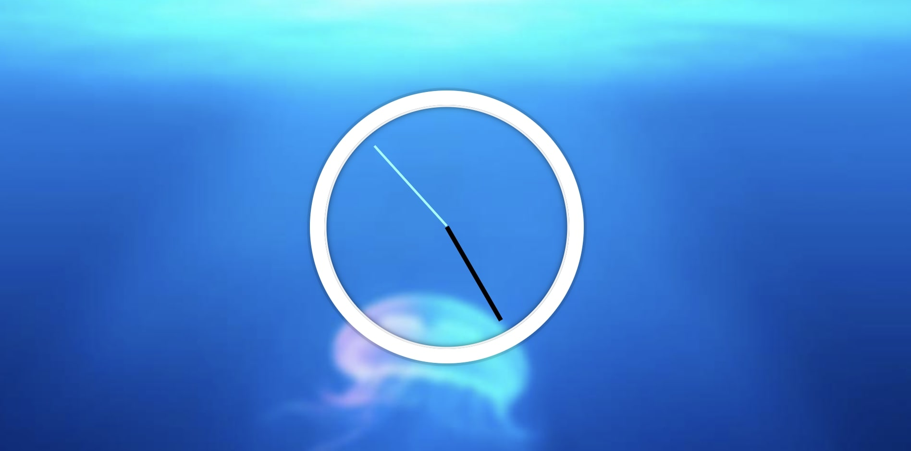

# 02 - Javascript and CSS clock


## Main goals

- Have the css take in the time from javascript and update the hands based on the current time.

## Learning Notes
### Transform-origin CSS attribute
Without setting this attribute, an element will transform around the center of itself. If you set it to 100%, it'll transform around the end of itself, like the hands of a clock do
```css
.hand{
    width: 50%;
    height: 6px;
    background: black;
    position: absolute;
    top: 50%;
    transform-origin: 100%;
    transform: rotate(90deg);
}
```

### Getting minutes and hours from JS Date
I already knew about the JS Date function, but didn't know about the extra now.getHours() etc
``` javascript
const now = new Date()

now.getHours()
now.getMinites()
now.getSeconds()
```

### setInterval() repeats an action
setInterval takes in the code you want to run, and the delay in milliseconds
``` javascript
setInterval(code, delay)
setInterval(setDate, 1000) // get the date every second
```
