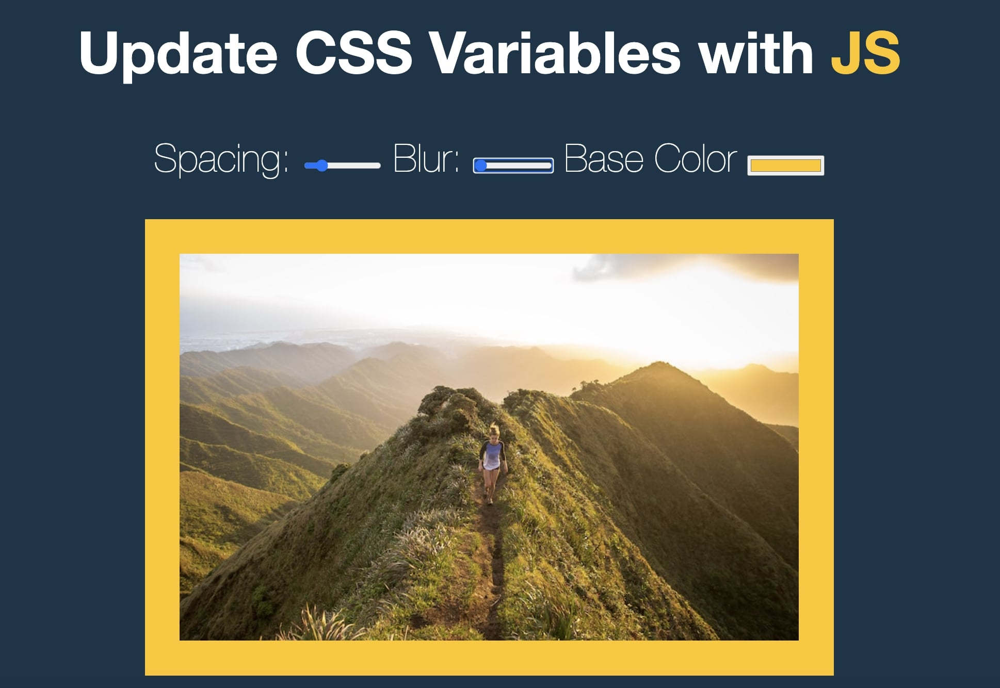

# 03 - CSS Variables with JS


## Main goals

- Allow a user to update CSS variables that impact the image using sliders or colour pickers.

## Learning Notes
### What the heck CSS variables are

I realised I've used CSS variables when creating a color palette for a previous project. I didn't really understand what the purpose of :root was until now.

``` css
:root {
    --base: #ffc600;
    --spacing: 10px;
    --blur: 10px;
}

img {
    padding: var(--spacing);
    background: var(--base);
    filter: blur(var(--blur))
}
```

### Node list vs array
An array includes all kinds of methods for dealing with an array (i.e. map, reduce, filter etc). A node list only has a couple (you can find them under __proto__ in dev tools). Node lists still store items in numeric indices but it's limited in its methods. The querySelectorAll method will return a NodeList. This is worth remembering if you need to do more with the results of this method.
Recently, forEach has been added to the node list methods so no need to change to an array as much.


### Datasets
This was covered a little in a previous day, but explained more here.
Datasets are an object that contain all of the data attributes from that specific elements. You can prefix anything with "data-" with a value and it'll be included in a dataset object.
``` html
<label for="spacing">Spacing:</label>
<input id="spacing" type="range" name="spacing" min="10" max="200" value="10" data-sizing="px">
```

In this example, it's the data-sizing. So if you console.log the dataset you'd get:

```
DOMStringMap {sizing: "px"}
```

