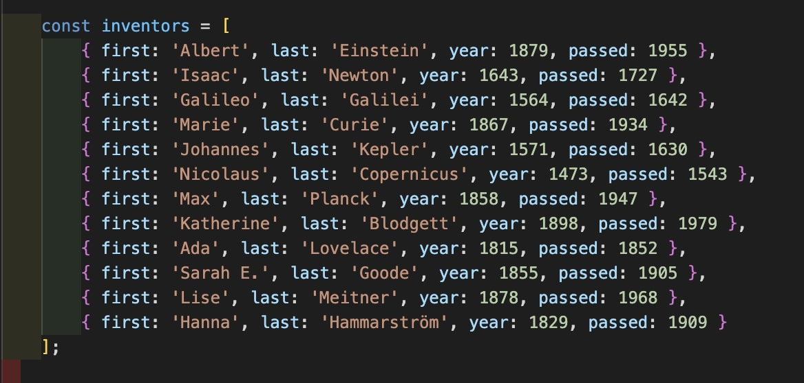

# 04 - Array Methods Day 1


## Main goals

- Get some practice in using array methods

## Learning Notes
### Remember that arrow functions have an implicit return

The first task, I initially wrote like this:
``` javascript
// Array.prototype.filter()
// 1. Filter the list of inventors for those who were born in the 1500's

const fifteen = inventors.filter(inventor => {
    if (inventor.year >= 1500 && inventor.year <= 1599) {
        return true;
}   
})
```

But was reminded about the implicit return and truthy/falsey of JS and refactored to:
``` javascript
const fiften = inventors.filter(inventor => inventor.year >= 1500 && inventor.year <= 1599)
```

### Turning a node list into an array
In a previous exercise, we noted that querySelectorAll returned a node list which doesn't have all array methods available to it. In these cases, you might need to turn this node list into an array. 

There's two ways of doing this:
1. Using the Array.from method
``` javascript
const links = Array.from(category.querySelectorAll('a'))
```

2. Using the spread operator from ES6
``` javascript
const links = [...category.querySelectorAll('a')]
```

### Chaining array methods
You can use multiple array methods in one variable
``` javascript
const de = links
            .map(link => link.textContent)
            .filter(streetName => streetName.includes('de'))
```