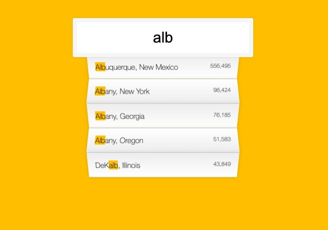

# 06 - Ajax Type Ahead


## Main goals

- Search feature that filters a JSON on whatever is typed in and returns matches while typing

## Learning Notes
### fetch
I've used fetch inumerable times in a React project but seeing it used outside of a React or node framework made it clearer where the framework ends and basic JS begins.

I.e. in the second .then() after the fetch, in React you'd just set the state to the returned JSON, but there is no state here, so it reminds you what you're actually doing with the data.

``` javascript
fetch(endpoint)
    .then(response => response.json())
    .then(data => cities.push(...data))
```

### RegExp
You can create a variable for your string to match as the search by creating a new RegExp object.
``` javascript
const regex = new RegExp(wordToMatch, 'gi')
```

The 'gi' here stands for global insensitive, i.e. search everywhere and don't be case sensitive.

The new variable can then be used in a match method:
``` javascript
return place.city.match(regex);
```

### Number with commas
The regex way of adding commas to large numbers:
``` javascript
function numberWithCommas(x){
    return x.toString().replace(/\B(?=(\d{3})+(?!\d))/g, ',')
}
```