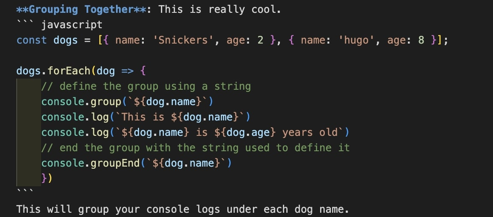

# 09 - Dev Tools Domination


## Main goals

- Learn some extra cool dev tools and tricks

## Learning Notes
### Add breaks
I've used break points before but this was a great reminder of how to do it.

In this example, you add a debugger break point on the paragraph tag to find out which line of code is causing the change of colour on click.

In the Elements tab, right click the p tag > Break on > attribute modification. Then click the paragraph in the window and the debugger will show you the line of code in the Sources tab that's making the modification.

### Console.log()
There are some cool things you can do with console.log that I wasn't aware of. 

**Interpolation**: console.log can take two arguments using %s as a placeholder
``` javascript
console.log("hello I am an %s string!", "interpolated")
```

**Styling**: You can style your consoled text using a %c placeholder in front of the thing you want to style.
``` javascript
console.log("%c I am some great text", "font-size: 50px")
```

**Testing**: create a statement that will only console if that thing is false
``` javascript
const p = document.querySelector('p')
console.assert(p.classList.contains('ouch'), "That is wrong")
```

**Viewing DOM Elements**: Use this to see all available methods and properties on DOM element
``` javascript
console.dir(p)
```

**Grouping Together**: This is really cool.
``` javascript
const dogs = [{ name: 'Snickers', age: 2 }, { name: 'hugo', age: 8 }];

dogs.forEach(dog => {
    // define the group using a string
    console.group(`${dog.name}`)
    console.log(`This is ${dog.name}`)
    console.log(`${dog.name} is ${dog.age} years old`)
    // end the group with the string used to define it
    console.groupEnd(`${dog.name}`)
    })
```
This will group your console logs under each dog name.


To set the default to have the group be collapsed in your console so it's cleaner, you do console.groupCollapsed() instead of just console.group()

**Timing**: If you want to time how long something takes, you can start a timer.
``` javascript
// start the timer using a specific string
console.time("fetching data");
fetch("https://api.github.com/users/wesbos")
    .then(data => data.json())
    .then(data => {
    // end the timer user the same string you used to start it
    console.timeEnd('fetching data')
    console.log(data)
    })
```