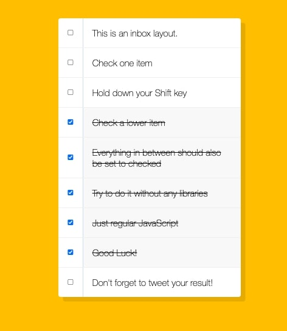

# 10 - Hold Shift and Check Checkboxes


## Main goals

- When a user clicks a checkbox, holds shift and clicks another box, all boxes between are checked.

## Learning Notes
### Keep tabs on the last checked box
So we can determine which box was the last one checked, and therefore which one to stop at, you create a variable to lastChecked and set it to this
``` javascript
let lastChecked;

function handleCheck(e){
    ...
    lastChecked = this
    ...
}
```

### Event shift keys
An event has a boolean attribute noting whether the shift key was pressed down or not - who knew!
You can then use that to verify if the shift key was pressed or not.
``` javascript
if(e.shiftKey && this.checked){
    // do something
}
```

### Flag variables
A flag variable is set to false as default and can be switched to true or back to false depending on something happening. Here we've used it to keep track of what's inbetween the first checked box and the last checked box.
``` javascript
function handleCheck(e){
    // flag variable
    let inBetween = false;
    //check if they had the shift key down
    // and check that they are checking it (not unchecking it)


    if(e.shiftKey && this.checked){
    // loop through every checkbox and see if it's the first one, then continue until it's the last one
        checkboxes.forEach(checkbox => {
        // console.log(checkbox)
        if(checkbox === this || checkbox === lastChecked){
            // switch the flag variable's boolean
            inBetween = !inBetween
        }

        // if a checkbox's inBetween variable is true, make the box checked
        if(inBetween){
            checkbox.checked = true;
        }
    })
  }
  lastChecked = this
}
```