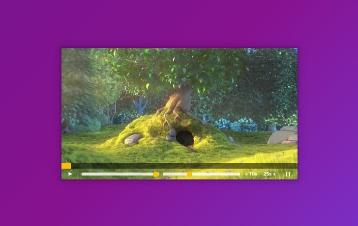

# 11 - Custom Video Player Controls


## Main goals

- Create custom controls for the in-built video player

## Learning Notes
### Video player has inbuilt methods
Play and pause are built in

``` javascript
function togglePlay(){
    if(video.paused){
        video.play()
    } else {
        video.pause()
    }
}
```

But there are so many others! Remember, to see all the methods you can console.dir(video) and peruse what's going on.

Another way to write this play/pause method is:

``` javascript
function togglePlay() {
    const method = video.paused ? 'play' : 'pause';
    video[method]();
}
```

### Making fullscreen
As a bonus challenge, you could add an extra button to make the video play go to full screen and back again.
I added a button next to the skip buttons, then the javascript is so:

``` javascript
// grab the element
const fullScreen = player.querySelector('.fullscreen')

// build a function
function handleFullScreen(){
    if(!document.fullscreenElement){
        player.requestFullscreen()
        fullScreen.textContent = 'exit'
    } else {
        document.exitFullscreen()
    }
}

// add event listener
fullScreen.addEventListener('click', handleFullScreen)
```