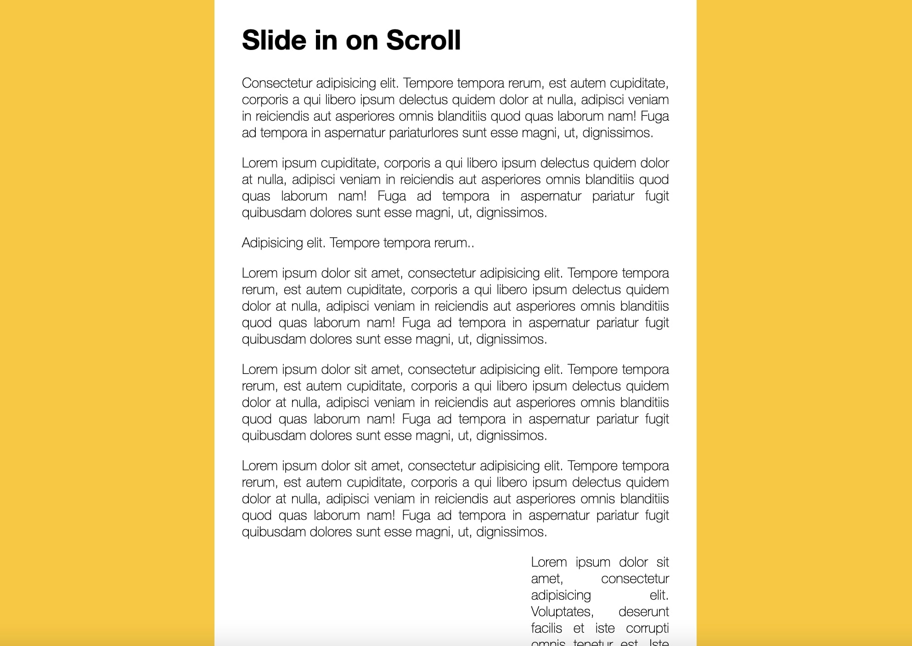

# 13 - Slide  in on Scroll


## Main goals

- Slide in the images as a user scrolls up and down a page

## Learning Notes
### Limit the number of events that trigger a response 

This is a typical debounce function that is useful to use on a scroll event. Every click of a scroll wouldn't be the trigger because that's far too many. A debounce takes in a wait time for waiting between event listeners.

``` javascript
function debounce(func, wait = 20, immediate = true) {
    var timeout;
    return function() {
    var context = this, args = arguments;
    var later = function() {
        timeout = null;
        if (!immediate) func.apply(context, args);
    };
    var callNow = immediate && !timeout;
    clearTimeout(timeout);
    timeout = setTimeout(later, wait);
    if (callNow) func.apply(context, args);
    };
}
```

The debounce function will wait 20ms before registering an event, which will reduce browser overhead
