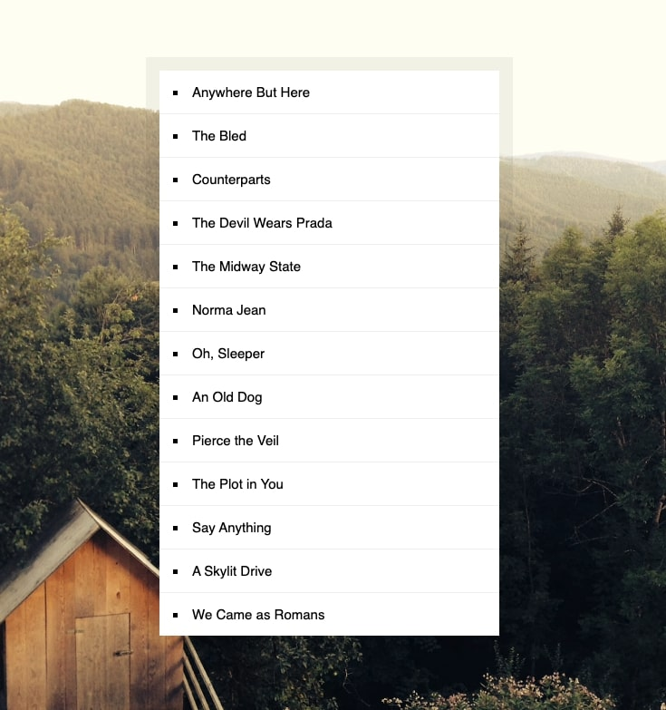

# 17 - Sort Without Articles


## Main goals

- Learn the array.sort() method while excluding the 'the' or 'an' or 'a' in the strings and put the items into a list.

## Learning Notes
### Replace method with regex

You can target specific words or letters and replace them with nothing - that's how you get the sort to ignore specific parts of a string.

``` javascript
function strip(bandName){
  return bandName.replace(/^(a |the |an )/i, '').trim()
}

const sortedBands = bands.sort(function(a, b) {
  if(strip(a) > strip(b)){
    return 1;
  } else {
    return -1;
  }
})
```

- ^ targets the start of the string
- | separates the options to replace
- i means it's not case sensitive
- '' is replacing those options with nothing
- .trim() removes whitespace from the end of the string

NOTE: the options you want to replace, i.e. (a |the |an ) do not have a space to their left because in the string, they're at the start and so don't have a space to the left. 